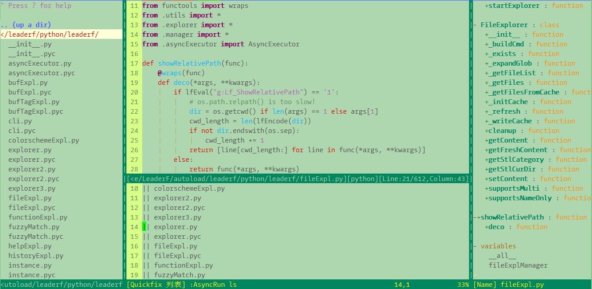
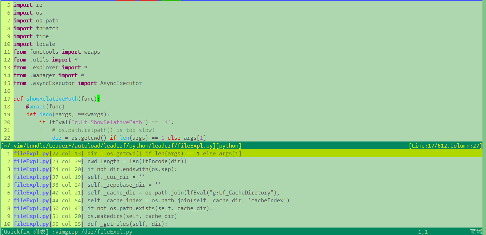

## Introduction

个人工作总结的VIM配置，基本满足工作编程需要，快捷键基于个人使用习惯，供大家参考。

### screenshot

**UI**

**search**

### Installation

**Linux**

	git clone https://github.com/Renxiuhu/VimProfiles.git 
	cp -r VimProfiles/* ~/
	vim

**Windows**

- git clone https://github.com/Renxiuhu/VimProfiles.git
- 	将库中内容复制到用户个人目录中(.tmux.conf是关于TMUX的配置，可以删除）
- 	将.vimrc重命名为_vimrc
- 	启动vim

### Usage

**Key Mapping:**

| 按键             | 含义          |
| -------------   |:-------------|
| F2              | 关闭当前buffer                                |
| F3              | 退出vim                                       |
| F4              | 保存文件                                      |
| F5              | 打开文件浏览器                                |
| F6              | 打开tagbar                                   |
| F7              | 查找光标位置的词语                             |
| F8              | 替换光标位置的词语                             |
| F11             | 开关代码缩进线                                 |
| F12             | 打开文件历史记录                               |
| w  v            | 垂直分割当前窗口                               |
| w  x            | 水平分割当前窗口                               |
| w  c            | 关闭当前窗口                                   |
| l  n            | 开关行号                                      |
| f  x            | 打开quickfix窗口                              |
| a  s            | 调用AsyncRun执行异步操作                       |
| t               | vim中打开shell                                |
| b  u            | 打开buffer list                               |
| f  u            | 打开当前文件函数列表                            |
| m               | 标记光标下词语                                 |
| y  s            | 打开剪切板，查看历史记录                      |
| y  c            | 清空剪切板                                    |
| Ctrl n          | 新建buffer                                    |
| Ctrl c          | 复制                                          |
| Ctrl x          | 剪切                                          | 
| Ctrl v          | 粘贴                                          |
| Ctrl a          | 全选                                          |
| Ctrl \          | 注释、反注释                                   |
| Ctrl p          | 打开文件搜索                                   |
| Ctrl Shift - s  | 搜索光标下变量名或函数名调用位置（需要gtags支持） |

### Changelog

* 2018/1/18: 添加YankRing插件，修改快捷键
* 2018/1/5: 初次提交

--------------------------------------------------------------------------------
